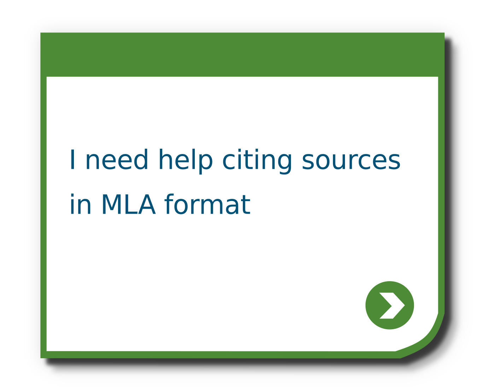
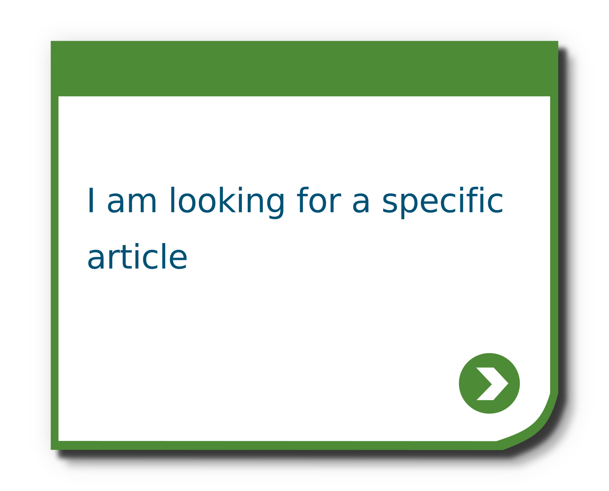
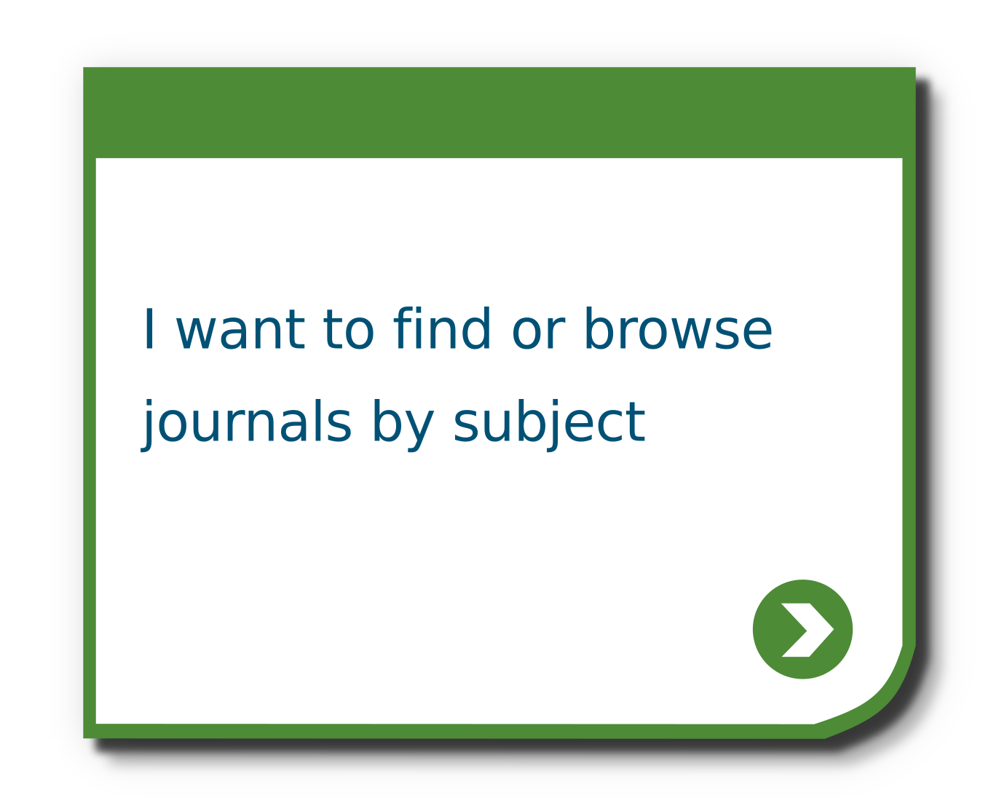

# Library DIY Button Creator



This python script batch-creates button images that can then be uploaded to a LibGuide or other content management system to create a Library DIY framework. Library DIY is a self-guided research help tool originally created by Portland State University Library. To access their orignial Drupal/PHP-based solution, visit the [PSU Library GitHub](https://github.com/pdxlibrary/Library-DIY).

## Software Dependencies

- Python 3: to run .py script.
    - Install Python 3.7 here: https://www.anaconda.com/products/individual
    
- Inkscape 1.0: to [customize look of button images](#customizing-the-button-images) and for .svg-to-.png file conversion.
    - Install Inkscape 1.0 here: https://inkscape.org/release/inkscape-1.0/
    - MUST BE VERSION 1.0; will not work with a previous version of Inkscape. 

## Usage

### Specifying the button content

You can configure the button text so it is useful for your needs. 
To generate buttons with text different than what currently exists in the file of this [library_diy python project](https://github.com/selegra/library_diy), just create a .txt file in the same folder where you saved the project file. 
Add the button text you want. 
Create multiple .txt files if you want the resulting image files to be sorted into distinct folders upon creation. 

Remember, each button's text **MUST BE** entered on its own line. These .txt files **MUST BE** saved in the same folder as the .py script.

Each time you run the .py script, it will recognize any new .txt files (or changes to the .txt files) within the folder containing the .py script, and it will create new button images to match.

For example, you might create a file named `some_buttons.txt` that contains

```
I am looking for a specific article

I want to find or browse journals by subject

```

[Running the batch button creator](#running-the-script) will create a new folder `some buttons`, in which two button images (saved as both .svg and .png) will be created as shown below. All images created from the text in one .txt file will be saved in their own folder labeled with the same name as the .txt file.




### Customizing the button images

From the downloaded project file, open `LibraryDIYTileTemplate.svg` in Inkscape. Edit colors, fonts, size, etc. according to your needs. Save file changes. DO NOT change the file name or save to a different location on your computer - it must keep the same name and location for the .py script to recognize it.

### Running the script

In a terminal or command prompt, navigate to this project's root directory. To learn more about navigating in command prompt, see this [tutorial](https://youtu.be/MBBWVgE0ewk?t=134).

Then run

```
python batch_button_maker.py
```

## Current limitations
- for current limitations, see [Issues](https://github.com/selegra/library_diy/issues)
